# 《Head First JavaScript》读书笔记
---

# Chapter10 函数

### 函数声明:
```javascript
function quack(num) {
  for (var i = 0; i < num; i++) {
    console.log("Quack!");
  }
}
quack(3);
```

### 函数表达式:
```javascript
var fly = function(num) {
  for (var i = 0; i < num; i++) {
    console.log("Flying!");
  }
};
fly(3);
```

### 函数声明 VS 函数表达式
1. 浏览器总是首先扫描代码，在其中查找函数声明。  
函数声明不返回指向函数的引用；  
2. 找到函数声明时，浏览器创建相应的变量，并将得到的函数引用赋给与函数同名的变量
3. 处理所有的函数声明后，浏览器回到代码开头，开始按从头到尾的顺序执行代码。函数表达式随其他代码一起被处理    
函数表达式返回一个引用， 该引用指向函数表达式创建的函数。


结果为一个值的任何东西都是表达式  
函数表达式的结果是一个函数引用

函数声明是一条语句。
它包含一条隐藏的赋值语句，这条语句将函数引用赋给一个变量。

函数表达式不自动将函数引用赋给任何变量，你必须显式地这样做。

### 作为一等公民的函数的特征
* 将函数赋给变量
* 将函数传递给函数
* 从函数返回函数

# Chapter11 匿名函数、作用域和闭包

### 匿名（ anonymous）
指的是没有名称的函数。
通过使用匿名函数，可让代码更简洁精练，可读性更强，效率更高，甚至更易于维护
```javascript
setTimeout(function() {
	    alert("Time to take the cookies out of the oven");
	  }, 600000);
```

在需要函数引用的地方，都可使用函数表达式，因为其结果就是一个函数引用。  
如果需要将一个函数作为实参，可将实参指定为函数表达式。  
同样，如果需要从函数返回一个函数，也可返回一个函数表达式。  


可将函数声明放在任何地方，且可在任何地方调用它们。在代码的任何地方，函数声明创建的函数都是已定义的，这被称为 `提升（ hoisting）`

函数表达式显然不同，它创建的函数要等到它执行后才被定义。


### 嵌套函数
在代码顶层定义的函数与在函数中定义的函数之间的唯一差别在于，它们的作用域不同。

在代码顶层定义的函数是全局的，而在函数中定义的函数是局部的

### 词法作用域 
JavaScript的作用域规则完全基于代码的结构，而不是一些动态的运行阶段属性
词法作用域的**优点**: 总是可以通过查看代码来确定变量是在哪里定义的，进而确定它的值。

```javascript
var justAVar = "Oh, don't you worry about it, I'm GLOBAL";
function whereAreYou() {
  var justAVar = "Just an every day LOCAL";
  function inner() {
    return justAVar;
  }
  return inner;
}
var innerFunction = whereAreYou();
var result = innerFunction();
console.log(result);
```
所有的局部变量都存储在一个`环境（ environment）`中。  
**环境**:它存储了在局部作用域内定义的所有变量。
可将形参视为函数的局部变量，因此它们也包含在环境中。

当我们返回函数inner时， 返回的不仅仅是函数，还有与之相关联的环境。

```javascript
var innerFunction = whereAreYou();
```
这条语句执行完毕后， 我们就有了变量innerFunction， 它指向whereAreYou返回的函数（ 及其环境）。   
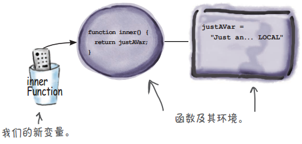

```javascript
var result = innerFunction();
```
调用innerFunction。 这将在相应的环境中执行它指向的函数的代码   
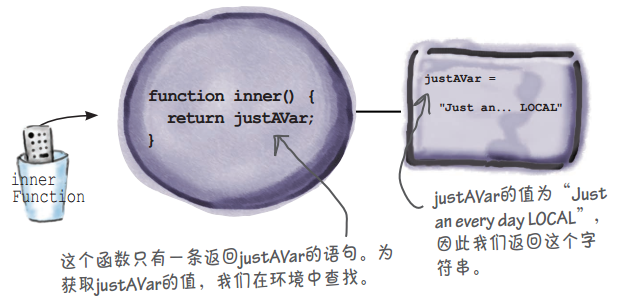

每个嵌套函数都有自己的小环境，其中包含它自己的变量。这样将形成一个环境链，从内到外依次为各个嵌套函数的环境。

在环境中查找变量时，你将从最近的环境着手，沿环境链不断往下查找，直到找到变量为止。如果在环境链中没有找到，再在全局环境中查找。

### 闭包 = 函数 + 其引用环境
`闭包` = 包含自由变量的函数 + 为所有这些自由变量提供了变量绑定的环境 

是极其强大的编程工具。   
闭包捕获其创建时所处作用域内的变量的值。

**局部变量**: 在函数体中定义的，包括所有的形参      
**自由变量**: 不是在本地定义的变量  


### 使用闭包实现神奇的计数器
没有使用闭包：  
```javascript
var count = 0;
function counter() {
  count = count + 1;
  return count;
}
console.log(counter());
```
问题是，使用全局变量count，协作开发代码时，大家常常会使用相同的变量名，进而导致冲突。


可以使用受保护的局部变量实现计数器。这样，计数器将不会与任何代码发生冲突，且只能通过调用相应的函数（也叫闭包）来增加计数器的值:
```javascript
function makeCounter() {
  var count = 0;
  function counter() {
    count = count + 1;
    return count;
  }
  return counter;
}
var doCount = makeCounter();
console.log(doCount())
```
在函数makeCounter中声明变量count。这样它就是局部变量， 而不是全局变量。  
这是一个闭包，在其环境中存储了变量count。  

### 通过将函数表达式用作实参来创建闭包
```javascript
function makeTimer(doneMessage, n) {
  setTimeout(function() {
    alert(doneMessage);
  }, n);
}
makeTimer("Cookies are done!", 1000);
```
方法setTimeout存储该函数引用（这是一个函数及其环境，即闭包），并在1000毫秒后调用它。   
我们传递给setTimeout的函数是一个闭包，因为它带有将自由变
量doneMessage绑定到字符串 Cookies are done! 的环境。


### 闭包包含的是实际环境，而非环境的副本
如果闭包函数外面的代码修改了变量，闭包函数执行时看到的将是变量的新值。
```javascript
function setTimer(doneMessage, n) {
  setTimeout(function() {
    alert(doneMessage);
  }, n);
  doneMessage = "OUCH!";
}
setTimer("Cookies are done!", 1000);
```
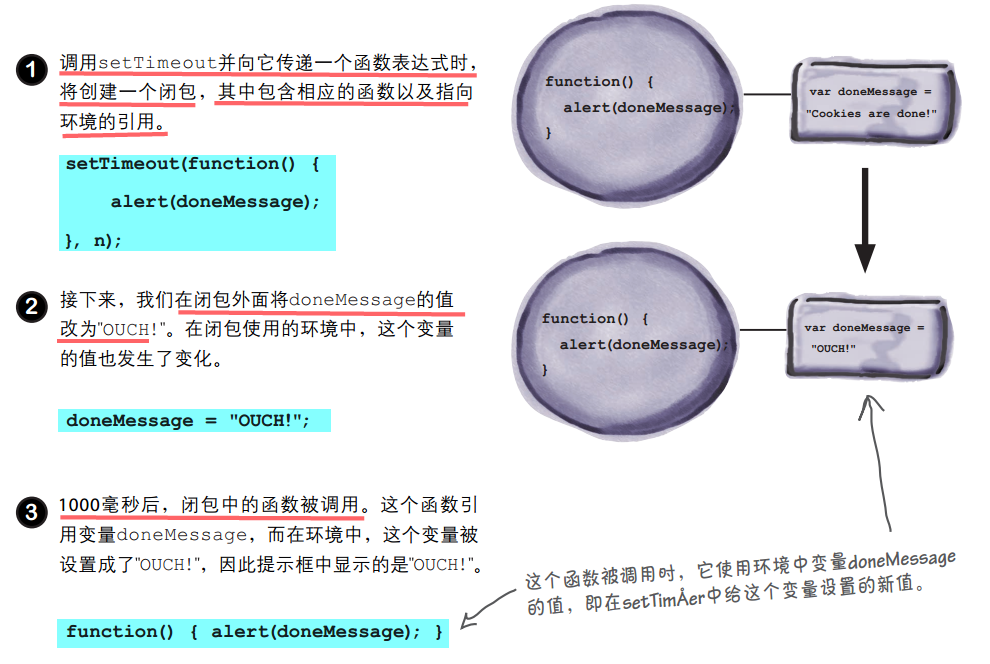   

# Chapter12 对象

## 对象字面量创建对象
逐个地指定其属性：
```javascript
var taxi = {
  make: "Webville Motors",
  model: "Taxi",
  year: 1955,
  color: "yellow",
  passengers: 4,
  convertible: false,
  mileage: 281341,
  started: false,

  start: function() { this.started = true; },
  stop: function() { this.started = false; },
  drive: function() {
    // 方法drive的代码
  }
};
```
对象字面量提供了一个便利方式，让你能够在代码中随时随地创建对象 ，    
但需要创建大量对象（如一个出租车车队）时，你不想输入数百个对象字面量，不是吗？


## 对象构造函数
犹如一个小型工厂，能够创建无数类似的对象。  
从代码的角度看，构造函数很像**返回对象的函数**：  
定义后，每当需要创建新对象时都可调用它。  

像饼干模具的对象创建方式，可帮助创建基本结构相同的对象。   
这样，创建的所有对象都将看起来一样，它们包含在一个地方定义的所有属性和方法。

### 创建构造函数
step1: 先定义一个构造函数  
step2: 再使用它来创建对象  

给构造函数命名时，采用了首字母大写的方式。    
并非必须这样做，但人人都将此视为一种约定加以遵守。   
让开发人员能够一眼就看出哪些函数是构造函数，哪些函数是常规函数。 
```javascript
function Dog(name, breed, weight) {
  this.name = name;
  this.breed = breed;
  this.weight = weight;
}
```
函数的形参对应于要给每个小狗对象提供的属性。   
属性名和形参名不必相同，但通常相同——这也是约定。   
出于提高清晰度的考虑，常常让形参与属性同名。   
这样只需查看构造函数的定义，就知道要给哪些属性赋值。       
这个构造函数什么都没有返回。    

创建一个名称为Fido、 品种为Mixed、体重为38磅的小狗对象：  
```javascript
var fido = new Dog("Fido", "Mixed", 38);
```

通过这种方式创建小狗对象，可确保每个小狗对象都包含相同的属性： name、 breed和weight。

## 构造函数的工作原理

1. new首先创建一个新的空对象。
2. 接下来，new设置this，使其指向这个新对象。   
this存储了一个引用，指向代码当前处理的对象。
3. 调用函数Dog，并将Fido、Mixed 和38作为实参传递给它。
4. 执行这个函数的代码。Dog给新创建的this对象的属性赋值。
5. Dog函数执行完毕后，运算符new返回this——指向新创建的对象的引用。  
请注意，它会自动为你返回this，你无需在代码中显式地返回。    
指向新对象的引用被返回后，我们将其赋给变量fido。

对象创建后，当你对其调用方法时，this被设置为方法被调用的对象。   
因此，在方法中，this总是表示方法被调用的对象。


## 向构造函数添加方法
在对象中，方法也是属性，只是将函数赋给了这种属性。  
```javascript
function Dog(name, breed, weight) {
  this.name = name;
  this.breed = breed;
  this.weight = weight;
  this.bark = function() {
    if (this.weight > 25) {
      alert(this.name + " says Woof!");
    } else {
      alert(this.name + " says Yip!");
    }
  };
}
```
测试bark方法：  
```javascript
var fido = new Dog("Fido", "Mixed", 38);
var fluffy = new Dog("Fluffy", "Poodle", 30);
var spot = new Dog("Spot", "Chihuahua", 10);
var dogs = [fido, fluffy, spot];
for (var i = 0; i < dogs.length; i++) {
  dogs[i].bark();
}
```

## 创建对象时，忘了使用关键字new
```javascript
function Album(title, artist, year) {
  this.title = title;
  this.artist = artist;
  this.year = year;
  this.play = function() {
    // 其他代码
  };
}
var darkside = Album("Dark Side of the Cheese","Pink Mouse", 1971);
darkside.play();
```
构造函数也是函数，不使用关键字new也能够调用它。   
但调用构造函数时如果忘记了使用new，可能导致代码出现难以找出的bug。  
```
Uncaught TypeError: Cannot call method 'play' of undefined
```

## new
一个与构造函数一起用来创建对象的运算符。   
运算符对操作数进行操作。   
new只操作一种操作数，那就是函数调用。  

## 用对象字面量替代实参
构造函数Car包含大量的形参，难以阅读和维护。  
另外，调用这个构造函数的代码编写起来也比较困难。   
```javascript
function Car(make, model, year, color, passengers, convertible, mileage) {
  this.make = make;
  this.model = model;
  this.year = year;
  this.color = color;
  this.passengers = passengers;
  this.convertible = convertible;
  this.mileage = mileage;
  this.started = false;
  this.start = function() {
    this.started = true;
  };
  // 其他方法
}
var cadi = new Car("GM", "Cadillac", 1955, "tan", 5, false, 12892);
```

**工作原理：**   
将所有实参都放到一个对象字面量中，再将这个对象字面量传递给函数。  
这将通过一个容器（对象字面量）传递所有的值，从而不必操心实参与形参的顺序问题。

1. 对于调用构造函数Car的代码，可重写为下面这样：  
```javascript
var cadiParams = {make: "GM",
                  model: "Cadillac",
                  year: 1955,
                  color: "tan",
                  passengers: 5,
                  convertible: false,
                  mileage: 12892};
var cadi = new Car(cadiParams);
```
只需将所有实参都存储到对象字面量的恰当属性中即可。   我们使用了构造函数使用的属性名。

2. 修改构造函数Car
* 将构造函数Car的7个形参替换为1个，用于表示要传入的对象。   
* 将每个形参引用都替换为传递给函数的对象的相应属性。
* 在方法中,没有直接使用形参。  
这合乎情理，因为在方法中应总是通过关键字this使用对象的属性。  
因此，这些代码无需作任何修改。  
```javascript
function Car(params) {
  this.make = params.make;
  this.model = params.model;
  this.year = params.year;
  this.color = params.color;
  this.passengers = params.passengers;
  this.convertible = params.convertible;
  this.mileage = params.mileage;
  this.started = false;
  this.start = function() {
    this.started = true;
  };
  this.stop = function() {
    this.started = false;
  };
  this.drive = function() {
    if (this.started) {
      alert("Zoom zoom!");
    } else {
      alert("You need to start the engine first.");
    }
  };
}
```

## 确定对象是哪种类型——由哪个构造函数创建
在JavaScript中，对象是一个动态的结构，无论对象包含哪些属性和方法，其类型都是object。   
运算符`typeof`返回其操作数的类型。

每当你使用运算符new调用构造函数时，都将创建一个新的对象实例。   
如果你使用构造函数Car创建一个对象，这个对象就是汽车；   
更准确地说，这个对象就是一个Car实例。

使用运算符`instanceof`来确定对象是由哪个构造函数创建的。   
```javascript
var cadiParams = {make: "GM", model: "Cadillac", year: 1955,   
 color: "tan", passengers: 5, convertible: false, mileage: 12892};
var cadi = new Car(cadiParams);
if (cadi instanceof Car) {
  console.log("Congrats, it's a Car!");
};
```
如果对象是由指定的构造函数创建的，运算符instanceof将返回true。

创建对象时，运算符new在幕后存储了一些信息，让你随时都能确定对象是由哪个构造函数创建的。   
运算符instanceof就是根据这些信息来确定对象是否是指定构造函数的实例。

## 修改用构造函数创建的对象
使用构造函数创建对象后，可对其进行修改，   
因为使用构造函数创建的对象是可以修改的。

对象字面量创建的对象，可在对象创建后增删其属性。   
对于使用构造函数创建的对象，也可这样做。

使用构造函数Dog创建的小狗对象fido。
```javascript
var fido = new Dog("Fido", "Mixed", 38);
```
给这个对象添加新属性， 只需给这个新属性赋值即可。   
可使用运算符`delete`删除既有的属性。  
```javascript
fido.owner = "Bob";
delete fido.weight;
```
添加新方法,只需将这个方法赋给一个新属性：
```javascript
fido.trust = function(person) {
    return (person === "Bob");
};
```
这只修改了对象fido。如果给对象fido添加一个方法，那么只有fido对象有这个方法，其他小狗对象都不会包含这个方法。   

修改汽车对象后，它依然是汽车对象。  
通常，你不会使用构造函数来创建一个对象，再将它修改得面目全非，看起来根本不像是使用这个构造函数创建的。   
一般而言，你使用构造函数来创建相当一致的对象；   
但如果你希望对象更灵活，JavaScript也提供了这样的支持。

## 内置构造函数
JavaScript自带了一系列构造函数，可用于实例化一些便利的对象，  
如知道如何处理日期和时间的对象、擅于在文本中查找模式的对象以及颠覆你对数组的认识的对象。   

### 日期对象
```javascript
var now = new Date();
```
构造函数`Date`返回一个表示本地当前日期和时间的Date实例。

可使用其方法来操作日期和时间，还可获取其各种属性。
```javascript
var dateString = now.toString();  //返回一个表示日期的字符串,如“Thu Feb 06 2014 17:29:29 GMT-0800 (PST)”。
var theYear = now.getFullYear();  //返回日期中的年份
var theDayOfWeek = now.getDay();  //返回一个数字，指出日期对象表示的是星期几，如1（表示星期一）
```

通过向构造函数Date传递额外的实参，创建表示任何日期和时间的日期对象。
```javascript
var birthday = new Date("May 1, 1983");  //创建一个表示1983年5月1日的日期对象
var birthday = new Date("May 1, 1983 08:03 pm");  //在传入的字符串中包含时间，从而创建更具体的日期对象
```

### 数组对象
#### 创建数组
1. 使用构造函数来创建：  
```javascript
var emptyArray = new Array();  //创建一个长度为零的空数组。
emptyArray[0] = 99;  //添加元素
```

创建特定长度的数组对象   
```javascript
var oddNumbers = new Array(3);  //创建一个包含3个元素的数组
oddNumbers[0] = 1;
oddNumbers[1] = 3;
oddNumbers[2] = 5;
```

2. 方括号表示法（ []）,这实际上是直接使用构造函数Array的简写。
```javascript
var items = [];
var items = ["a", "b", "c"];  //数组字面量语法。
```
等同于：
```javascript
var items = new Array();
var items = new Array("a", "b", "c");  //如果传入了多个实参，创建的数组将以这些值作为元素。
```

#### 数组对象方法
```javascript
oddNumbers.reverse();  //按相反的顺序排列数组的所有元素（ 现在数组oddNumber依次包含5、 3和1）,这个方法修改原始数组。
var aString = oddNumbers.join(" - ");  //将数组oddNumbers中的值合并成一个字符串（这里在值之间加上-）， 并返回这个字符串。 返回字符串 “5 - 3 - 1”
var areAllOdd = oddNumbers.every(function(x) {
  return ((x % 2) !== 0);
});   
//方法every将一个函数作为参数；
//对于数组中的每个值，都调用这个函数，并判断该函数返回的值是true还是false。
//如果对于所有的元素，这个函数都返回true，那么方法every将返回true。
```

#### 字面量表示法 VS 构造函数创建对象

字面量表示法和构造函数创建的对象没什么两样。   
无论使用哪种方式创建对象后，都可使用其方法。   

创建简单数组时，使用数组字面量语法的效果很好；    
创建要等到运行阶段才能确定长度的数组时，用构造函数Array更合适。

```javascript
//可能创建一个很大的数组，其长度要等到运行阶段才知道。
var n = getNumberOfWidgetsFromDatabase();
var widgets = new Array(n);
for(var i=0; i < n; i++) {
  widgets[i] = getDatabaseRecord(i);
}
```

### 其他内置对象
* Object 你可使用构造函数Object来创建对象。与数组一样，对象字面量表示法{}与new Object()等价。   
* Math 这个对象包含用于执行数学运算任务的属性和方法，如Math.PI和Math.random()。   
可将Math视为一个包含一系列属性和方法的对象字面量，可供你编写JavaScript代码时随时使用。    
* RegExp 使用这个构造函数可创建正则表达式对象，让你能够在文本中搜索非常复杂的模式。   
* Error 这个构造函数创建标准错误对象，为你在代码中捕获错误提供了极大的便利。


# Chapter13 使用原型
JavaScript没有传统的面向对象模型，即从类创建对象的模型。   
事实上，JavaScript根本就没有类。  
在JavaScript中，对象从其他对象那里继承行为，我们称之为**原型式继承**（ prototypal inheritance）或**基于原型的继承**。   

相比于经典面向对象语言，基于原型的语言更通用。   
它们更灵活，效率更高，表达力更强。  

## 构造函数：它能让我们重用代码，但效率如何呢
```javascript
function Dog(name, breed, weight) {
  this.name = name;
  this.breed = breed;
  this.weight = weight;
  this.bark = function() {
    if (this.weight > 25) {
      alert(this.name + " says Woof!");
    } else {
      alert(this.name + " says Yip!");
    }
  };
}

var fido = new Dog("Fido", "Mixed", 38);
var fluffy = new Dog("Fluffy", "Poodle", 30);
var spot = new Dog("Spot", "Chihuahua", 10);
```
这些代码创建三个小狗对象。  
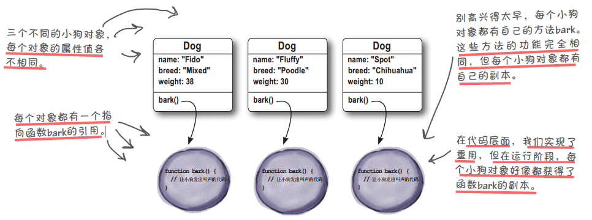

重复的方法:   
一般而言，我们不希望每次使用构造函数实例化一个对象时，都创建一组新的方法。  
这样会影响应用程序的性能，占用计算机资源。
这可能是个大问题，在移动设备上尤其如此。


## 对象图
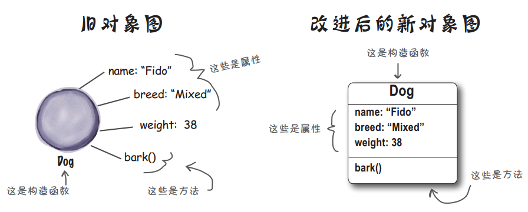  

## 原型
JavaScript对象可从其他对象那里继承属性和行为。   
JavaScript使用原型式继承，其中其行为被继承的对象称为**原型**  
这旨在继承既有属性（包括方法），同时在新对象中添加属性。   
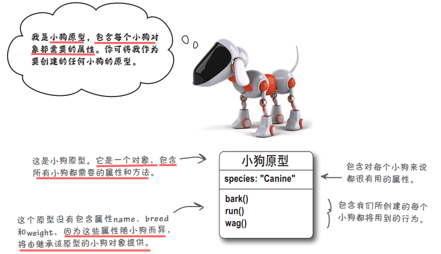   

## 继承原型:  
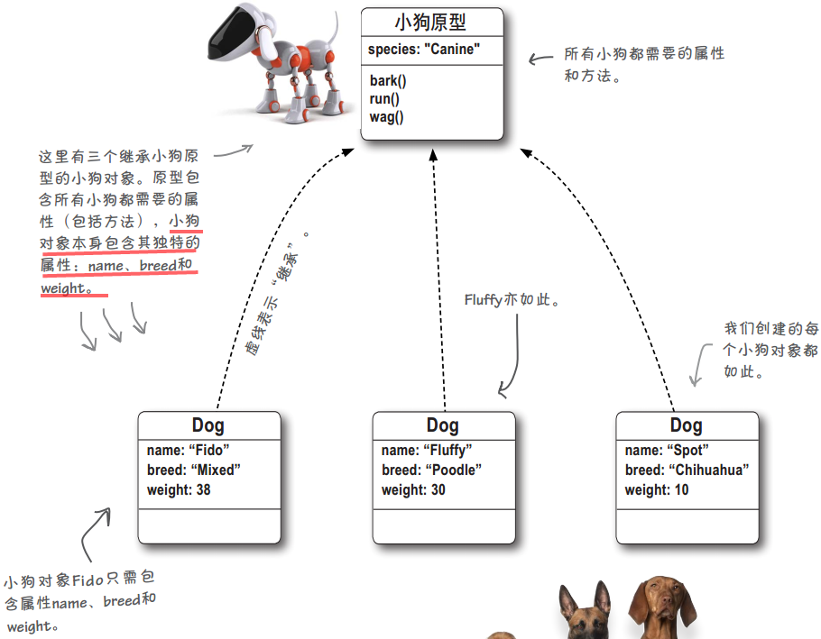  

## 继承工作原理
对对象调用方法时，如果在对象中找不到，将在原型中查找它。  
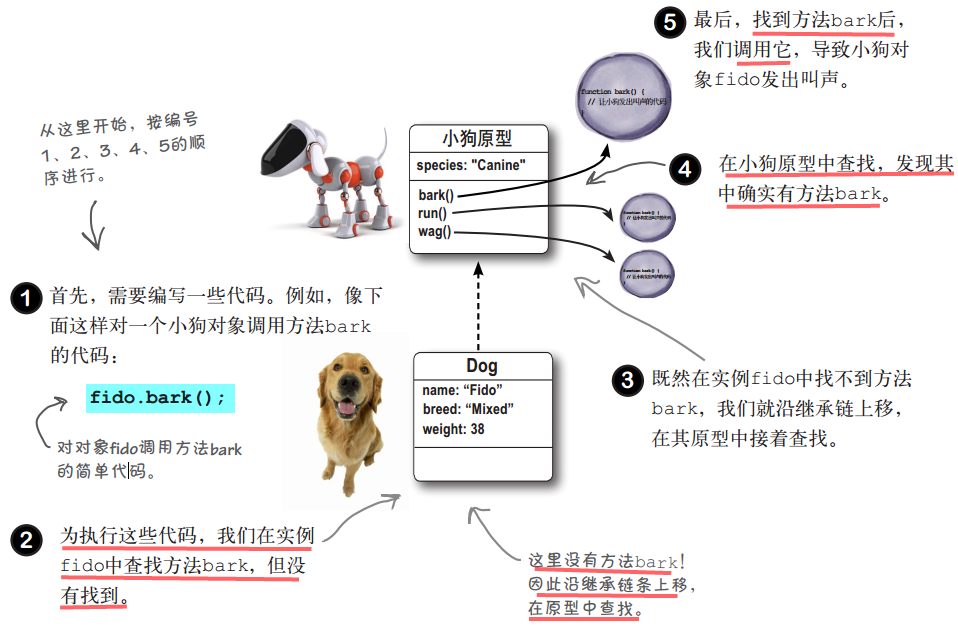  
我们实现了代码重用：不仅只需在一个地方编写代码，而且让所有小狗实例都在运行阶段使用同一个bark方法，从而避免了庞大的运行阶段开销。   

## 重写原型
继承原型并不意味着必须与它完全相同。     
在任何情况下，都可重写原型的属性和方法，只需在对象实例中提供它们即可。
这之所以可行，是因为JavaScript总是先在对象实例（即具体的小狗对象）中查找属性；如果找不到，再在原型中查找。   
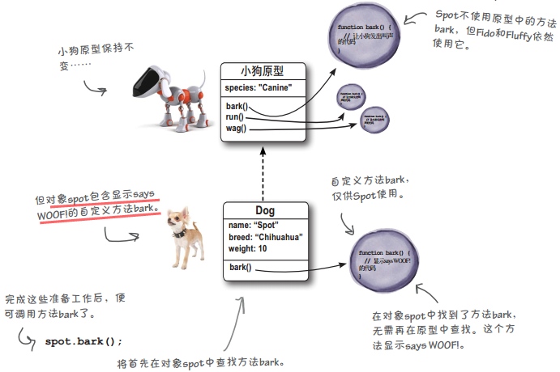 

## 构造函数的`prototype`属性
**prototype属性：**    
构造函数的属性；   
指向原型的引用。   

在代码中访问这个原型：
```javascript
Dog.prototype
```

在JavaScript中，函数也是对象。   
实际上，在JavaScript中，几乎所有的东西都是对象。  
除了具备你知道的各种功能外，函数还可以有属性，   
而构造函数都包含属性prototype。

## 设置原型
```javascript
//方法来自原型， 因此不需要在构造函数中定义它们。
function Dog(name, breed, weight) {
  this.name = name;
  this.breed = breed;
  this.weight = weight;
}

//创建构造函数后，便可以设置小狗原型了
Dog.prototype.species = "Canine";
Dog.prototype.bark = function() {
  if (this.weight > 25) {
    console.log(this.name + " says Woof!");
  } else {
    console.log(this.name + " says Yip!");
  }
};
Dog.prototype.run = function() {
  console.log("Run!");
};
Dog.prototype.wag = function() {
  console.log("Wag!");
};

//创建小狗对象
var fido = new Dog("Fido", "Mixed", 38);
var fluffy = new Dog("Fluffy", "Poodle", 30);
var spot = new Dog("Spot", "Chihuahua", 10);

//对每个小狗对象调用方法
//每个小狗对象都从原型那里继承了这些方法。
fido.bark();
fido.run();
fido.wag();
fluffy.bark();
fluffy.run();
fluffy.wag();
spot.bark();
spot.run();
spot.wag();
```

## 重写原型，给Spot提供自定义方法bark   
```javascript
spot.bark = function() {
  console.log(this.name + " says WOOF!");
};
```
### 疑惑
鉴于方法bark位于原型而不是对象中，其中的this.name怎么不会导致问题呢？  
在没有使用原型的情况下，这很容易解释，因为this指的是方法被调用的对象。调用原型中的方法bark时，你可能认为this指的是原型对象，但情况并非如此。   
调用对象的方法时，this 被设置为方法被调用的对象。
即便在该对象中没有找到调用的方法，而是在原型中找到了它，也不会修改this的值。   
在任何情况下，this都指向原始对象，即方法被调用的对象，即便该方法位于原型中亦如此。  

## 让所有的小狗都学会新技能
使用原型后，如果给原型添加一个方法，所有的小狗对象都将立即从原型那里继承这个方法并自动获得这种新行为，包括添加方法前已创建的小狗对象。

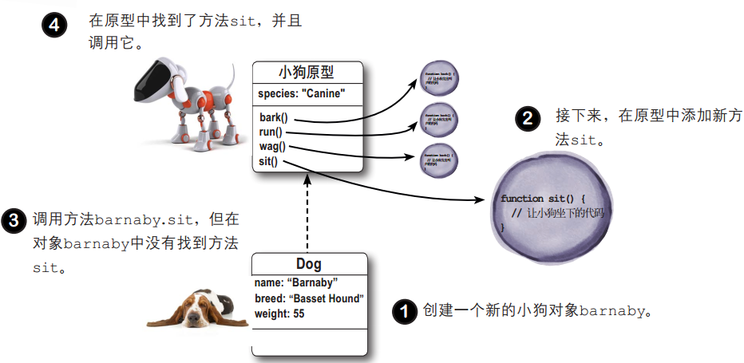  


## 原型是动态的
给原型添加新的方法或属性后，继承该原型的所有对象实例都将立即继承它。  

## 对初始值使用原型
在方法sit中，判断小狗是否是坐着的。如果不是，就让它坐着；如果是，就告诉用户小狗已经是坐着的。
```javascript
//属性sitting，用于跟踪小狗是否是坐着的。
Dog.prototype.sitting = false;
Dog.prototype.sit = function() {
  if (this.sitting) {
    console.log(this.name + " is already sitting");
  } else {
    this.sitting = true;
    console.log(this.name + " is now sitting");
  }
};
```
小狗实例刚创建时，从原型那里继承了属性sitting，该属性的值默认为false；  
但调用方法sit后，就给小狗实例添加了属性sitting的值，导致在小狗实例中创建了属性sitting。   
这让我们能够给所有小狗对象指定默认值，并在需要时对各个小狗进行定制。  
每个小狗对象都独立地跟踪自己是否是坐着的。  

## 属性sitting的工作原理
首次获取sitting的值时，是从原型中获取的；  
但接下来将sitting设置为true时，是在对象实例而不是原型中进行的。  
在对象实例中添加这个属性后，接下来每次获取sitting的值时，都将从对象实例中获取，因为它重写了原型中的这个属性。   
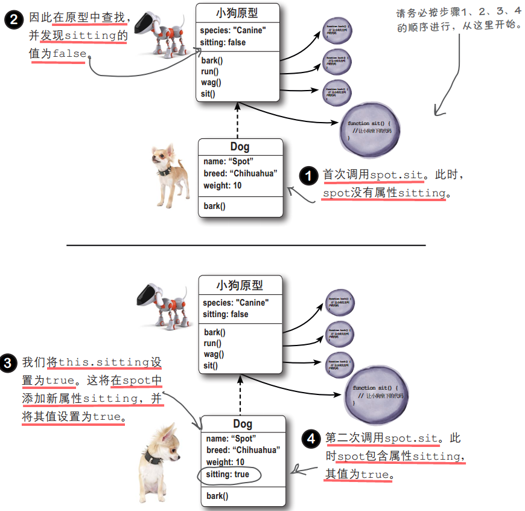  

## hasOwnProperty——判断使用的属性包含在实例还是原型中
如果属性是在对象实例中定义的，这个方法将返回true。   
如果属性不是在对象实例中定义的，但能够访问它，就可认为它肯定是在原型中定义的。   
```javascript
spot.hasOwnProperty("sitting");  //首次检查spot是否有自己的sitting属性时，结果为false
spot.sitting = true;  // 这将在实例spot中添加属性sitting
spot.hasOwnProperty("sitting");  //spot现在有自己的sitting属性,结果为true
```

## 使用JavaScript时，可以有多个原型

就像你得到的遗产。  
可建立供对象继承的原型链。 

假设你有一个小鸟原型，知道如何做大多数小鸟都会做的事情，如飞翔。
现在假设你需要实现各种鸭子——绿头鸭、红头鸭等。
但鸭子与一般的鸟不同。它们会游泳，我们不想将这个方法放在小鸟原型中。不过，在JavaScript中，可创建一个继承小鸟原型的鸭子原型。    

假设你创建了一个鸭子对象，并对其调用了方法fly。
如果在该对象中查找时，没有找到这个方法，你将如何做呢？   
你接着在鸭子原型中查找，可这里也没有方法fly。   
因此，你继续在鸭子原型继承的小鸟原型中查找，并在这里找到了方法fly。

我们不仅重用了鸭子原型的行为，必要时还可沿原型链往上走，进而使用小鸟原型的行为。   

## 建立原型链
对象不仅可以继承一个原型的属性，还可继承一个原型链。

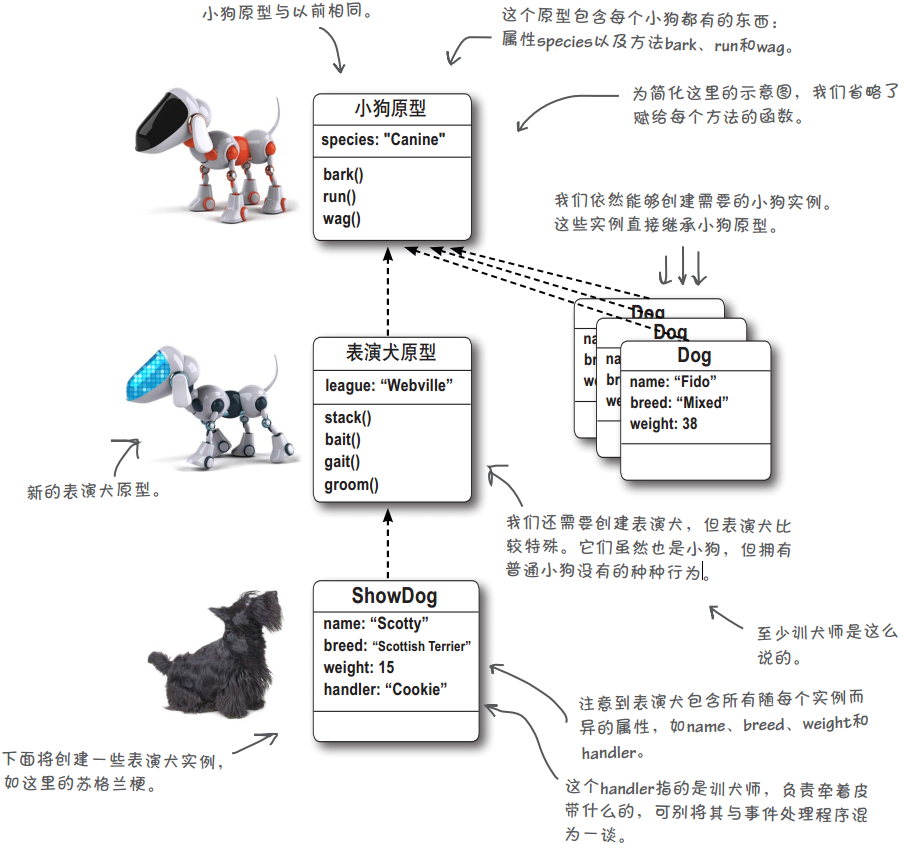  

## 原型链中的继承原理
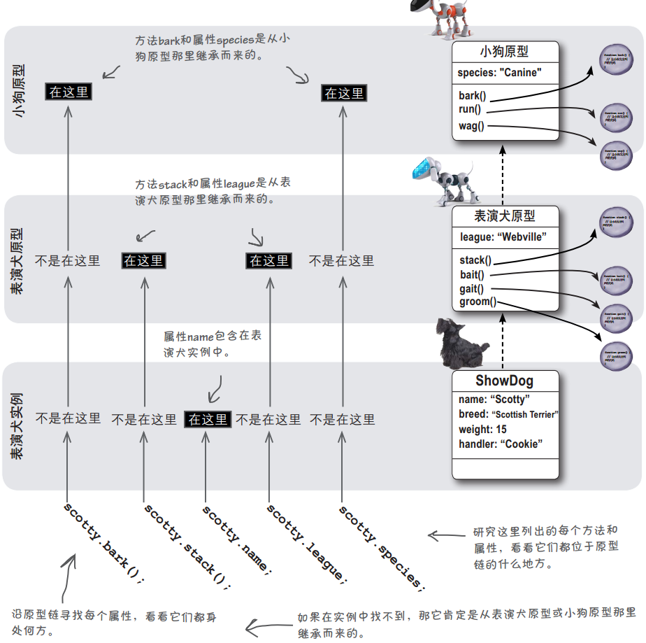  

## 创建表演犬原型
我们需要一个继承另一个原型（小狗原型）的原型对象。

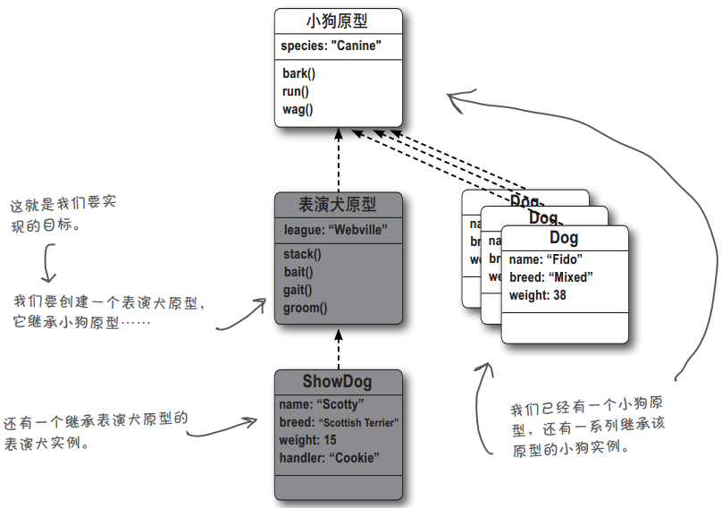  

1. 需要一个继承小狗原型的对象
```javascript
var aDog = new Dog();  
```

这里没有给构造函数提供任何实参,因为我们只需要一个继承小狗原型的小狗对象，而不关心其细节。   

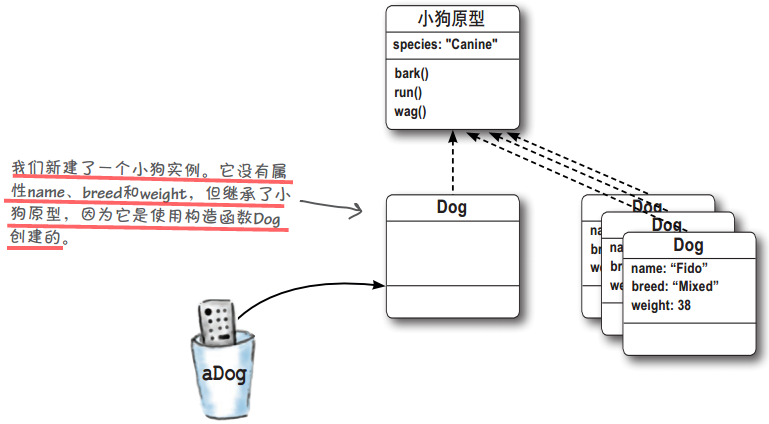

2. 将新建的小狗实例变成表演犬原型
```javascript
function ShowDog(name, breed, weight, handler) {
  this.name = name;
  this.breed = breed;
  this.weight = weight;
  this.handler = handler;
}

//将其属性prototype设置为一个新的小狗实例
ShowDog.prototype = new Dog();

//给表演犬添加的属性和方法
//获取充当表演犬原型的小狗实例，并给它添加新的属性和方法。
Showdog.prototype.league = "Webville";
ShowDog.prototype.stack = function() {
  console.log("Stack");
};
ShowDog.prototype.bait = function() {
  console.log("Bait");
};
ShowDog.prototype.gait = function(kind) {
  console.log(kind + "ing");
};
ShowDog.prototype.groom = function() {
  console.log("Groom");
};

//创建表演犬实例
var scotty = new ShowDog("Scotty", "Scottish Terrier", 15, "Cookie");
```

表演犬原型“ 扩展” 了小狗原型。  
它继承了小狗原型的属性，并添加了一些新属性。


## `instanceof`  && `constructor`
```javascript
var fido = new Dog("Fido", "Mixed", 38);
if (fido instanceof Dog) {
  console.log("Fido is a Dog");
}
if (fido instanceof ShowDog) {
  console.log("Fido is a ShowDog");
}
var scotty = new ShowDog("Scotty", "Scottish Terrier", 15, "Cookie");
if (scotty instanceof Dog) {
  console.log("Scotty is a Dog");
}
if (scotty instanceof ShowDog) {
  console.log("Scotty is a ShowDog");
}
console.log("Fido constructor is " + fido.constructor);
console.log("Scotty constructor is " + scotty.constructor);
```
结果：   
```console
Fido is a Dog
Scotty is a Dog
Scotty is a ShowDog
Fido constructor is function Dog...
Scotty constructor is function Dog..
```
instanceof不仅考虑当前对象的类型，还考虑它继承的所有对象。 Scotty虽然是作为表演犬创建的，但表演犬继承了小狗，因此Scotty也是小狗。  

Scotty的构造函数也是Dog。  
这不合理，因为它是使用构造函数ShowDog创建的。  

查看属性scotty.constructor。由于我们没有显式地为表演犬设置这个属性，它将从小狗原型那里继承该属性。  

虽然代码都没问题，但给对象设置正确的构造函数是一种最佳实践，以免有一天另一位开发人员接手这些代码并查看表演犬对象的情况时感到迷惑。 

这是一个需要修复的漏洞。
```javascript
ShowDog.prototype = new Dog();
ShowDog.prototype.constructor = ShowDog;
```

## call
构造函数Dog也包含这些代码:  
```javascript
function ShowDog(name, breed, weight, handler) {
this.name = name;
this.breed = breed;
this.weight = weight;
this.handler = handler;
}
```
每当我们发现重复的代码时，警报就会大响。

就这里而言，既然构造函数Dog已经知道如何完成这些工作，为何不让它去做呢？  
另外，虽然这个示例的代码很简单，但有些构造函数可能使用复杂的代码来计算属性的初始值。  
因此创建继承另一个原型的构造函数时，都不应重复既有的代码  

重写代码:  
```javascript
function ShowDog(name, breed, weight, handler) {
  Dog.call(this, name, breed, weight); //重用构造函数Dog中处理属性name、 breed和weight的代码
  this.handler = handler; //这里依然需要处理属性handler， 因为构造函数Dog对这个属性一无所知
}
```
### 原理
`call`是一个内置方法,可对任何函数调用它（Dog是一个函数）。   
Dog.call调用函数Dog，将一个用作this的对象以及函数Dog的所有实参传递给它。  
  

### Dog.call详解
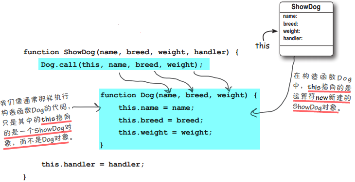

构造函数Dog执行完毕后（别忘了，我们调用它时没有使用运算符new，因此它不会返回任何对象），接着执行ShowDog中的其他代码，将形参handler的值赋给属性this.handler。  
接下来，因为我们调用ShowDog时使用了运算符new，所以将返回一个设置了属性name、 breed、 weight和handler的ShowDog实例。   

### 原型链的终点`Object`
你创建的每个原型链的终点都是Object。  
因为对于你创建的任何实例，其默认原型都是Object，除非你对其进行了修改。

可将Object视为对象始祖，所有对象都是从它派生而来的。    Object实现了多个重要的方法，是JavaScript对象系统的核心部分：
1. 方法hasOwnProperty——用来确定属性是在对象实例还是其原型中定义的。  
2. 方法toString——这个方法返回对象的字符串表示。  

你创建的每个对象都有原型，该原型默认为Object。你可将对象的原型设置为其他对象，就像我们对表演犬原型所做的那样，但所有原型链的终点都是Object。  
## 继承的威力之重写内置行为
重写方法toString
```javascript
function Robot(name, year, owner) {
  this.name = name;
  this.year = year;
  this.owner = owner;
}
var toy = new Robot("Toy", 2013, "Avary");
console.log(toy.toString());
```
结果：[Object object]    

在将机器人对象toy转换为字符串方面，方法toString做得并不好。   
可重写方法toString，让其为机器人对象创建独特的字符串：  
```javascript
function Robot(name, year, owner) {
  // 相同的代码
}
Robot.prototype.toString = function() {
  return this.name + " Robot belonging to " + this.owner;
};

var toy = new Robot("Toy", 2013, "Avary");
console.log(toy.toString());
```
结果：Toy Robot belonging to Avary  

有些情况下，会自动调用方法toString。   
如，如果你使用`运算符`+`来拼接字符串和对象`，   
JavaScript将自动调用方法toString将对象转换为字符串，  
再将该字符串与另一个字符串拼接起来。
```javascript
console.log("Robot is: " + toy); //调用方法toString将对象toy转换为一个字符串，再进行拼接
```
### 重写内置对象的属性和方法时，要特别小心
1. 千万不要重写Object的如下属性：
* constructor  //个原型相关联的构造函数
* hasOwnProperty  
* isPrototypeOf  //用于判断一个对象是否是另一个对象的原型
* propertyIsEnumerable  //用于判断通过迭代对象的所有属性是否可访问指定的属性

2. 可以重写:
熟悉原型并知道如何安全地重写属性后，就可以重写Object的如下属性了：
* toString
* toLocaleString  //类似于toString，也将对象转换为字符串 
* valueOf  //默认情况下在返回当前对象

### 继承的威力之扩展内置对象
通过给原型添加方法，可给其所有实例添加新功能。   
这不仅适用于自定义对象，还适用于内置对象。

用一个名为cliche的方法扩展String原型。  
这个方法会在字符串包含一个众所周知的俗语时返回true。
```javascript
String.prototype.cliche = function() {
  var cliche = ["lock and load","touch base", "open the kimono"];
  for (var i = 0; i < cliche.length; i++) {
    var index = this.indexOf(cliche[i]);
    if (index >= 0) {
      return true;
    }
  }
  return false;
};
```

务必确保你为新方法选择的名称不与对象的既有方法发生冲突。
有些内置对象是不能扩展的，如Array。 


