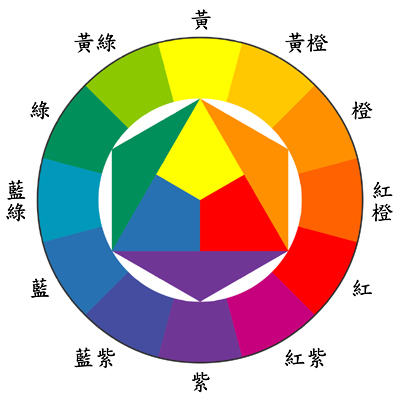
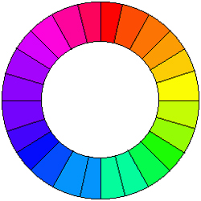
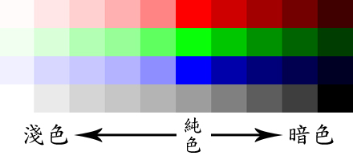
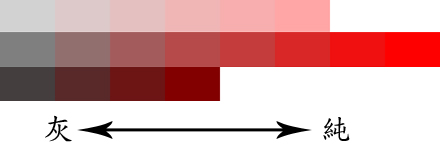
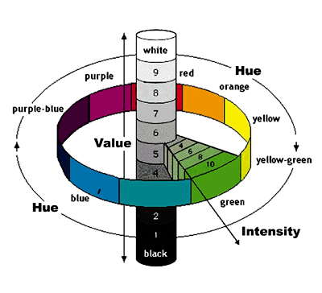

> 参考：[色环-维基百科](https://zh.wikipedia.org/wiki/%E8%89%B2%E7%92%B0)  
>[《基础设计》-第5讲-色彩](http://vr.theatre.ntu.edu.tw/fineart/th10_140/th10_140_05.htm)

當包浩斯設計學院成立時，在畫家教師康丁斯基﹝Wassily Kandinsky﹞和造型原理教師伊登﹝Johannes Itten﹞的指導之下，色彩是基礎設計的課程重點之一。尤其是伊登，他很強調從科學的角度去研究色彩，在二十世紀初，就提出了「基本色彩理論」﹝Basic Color Theory﹞。根據這個理論，他又進一步發展出一種新的「色環」﹝color wheel﹞，改變過去傳統對色彩的看法。這種色環後來被稱為「伊登色環」，至今一直都被廣為使用。   

  

色環上有三種最基本的顏色，紅色、黃色和藍色，我們稱它們為**「原色」**﹝primary colors﹞。原色為不能經由其他色彩混色而成的色彩，反之，其他色彩則可以由這三種原色混合而得。     

將三原色兩兩相互混合，會形成綠色、橙色、紫色，我們稱這三種顏色為**「第二次色」**﹝secondary colors﹞。     
再由原色與相鄰的第二次色相混合，形成黃綠色、黃橙色、藍綠色、藍紫色、紅橙色、紅紫色，我們稱這六種顏色為**「第三次色」**﹝tertiary colors﹞，有人另稱為「中間色」﹝intermediate colors﹞。   

將原色、第二次色和第三次色依照相混的順序排列成環狀造型，則形成**伊登色環**。  

----

伊登在他的色彩訓練課程中，主張色彩理論須與造型理論合一運用，將色彩以「色相」﹝Hue﹞、「明度」﹝Value﹞和「彩度」﹝Intensity﹞有三種基本要素，作為教學主軸來訓練學生對於色彩的敏感度與心理感受度。  

### 「色相」也稱為「色度」hue。  
肉眼在光線充足時，對不同的可視波長有不同的反應，而色相則是這些色彩的名稱，如紅、藍、綠等。因此，色相的功用便是標明色彩在光譜與色環中的位置。下圖所示的色環上面呈現了各種不同色相，不過藝術家為了清楚起見，一般是以十二色色環中的色相為標準。   
  

### 「明度」或稱「亮度」﹝brightness﹞是色彩由亮到暗的變化，或者是說色彩反射光亮的多寡。   
在任何色相的最亮與最暗之間，存在著許多明度階。因此在某一色相中添加黑色或白色能夠產生範圍廣闊的明度變化，若加入不同份量的白色所產生的色彩，稱之為「淺色調」﹝tints﹞；若加入黑色，則稱為「暗色調」﹝shades﹞。下圖顯示色相的明度變化，右邊趨向暗色調，左邊則趨向淺色調。   
  

### 「彩度」一詞有稱「飽和度」﹝saturation﹞是用來區分同色相中，較鮮豔或較模糊的差別，也就是分辨一個色彩是較飽和、較強烈，還是較灰濛或較微弱。   
當彩度稱為「濃度」﹝chroma﹞時，指的色彩的光線特質。一般來說，最飽和、最純粹的色彩，存在於光束穿過三棱鏡得出的光譜之中。不過，若藝術家運用的色料已是最接近光譜色彩的色料，就可以說這個色彩是最高彩度。

若將以上「色相」﹝Hue﹞、「明度」﹝Value﹞和「彩度」﹝Intensity﹞三者以立體方式呈現如下圖，更可了解彼此之間的關係。    
   

